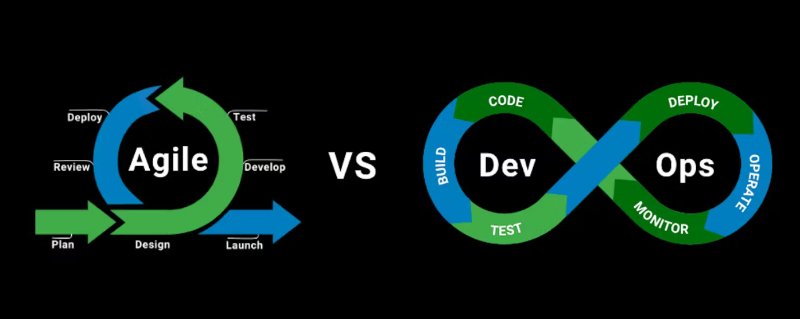

# 1: Introduction to DevOps

## 1.1 What is DevOps?

- DevOps is not a new tool or technology in the market.
- It is a new culture or process to develop, release, and maintain software products, projects, and applications with high quality in a faster way.
- This is achieved in DevOps by using several automation tools.
- For any software development, release, and maintenance, there are two main groups of engineers in a company:
  1. **Development Group**
  2. **Non-Development Group** (or Operations Group or Administrators Group)

### Development Group

The people involved in the following activities are considered part of the Development Group:
1. Planning
2. Coding
3. Build
4. Testing

### Example Roles in Development Group

- Business Analyst (BA)
- System Analyst (SA)
- Design Architect (DA)
- Developers/Coders
- Build Engineer
- Test Engineers/QA

### 2 Operations Group

The people involved in the following activities are considered part of the Operations Group:
1. Release
2. Deploy
3. Operate
4. Monitor

### Example Roles in Operations Group

- Release Engineers
- Configuration Engineer
- System Admin
- Database Admin
- Network Admin

DevOps is a combination of development and operations. The main objective of DevOps is to implement collaboration between development and operations teams.

  

To understand the new DevOps culture, it's essential to be aware of the existing Software Development Life Cycle (SDLC) models:

1. **Waterfall Model**
2. **Prototype Model**
3. **Incremental/Iterative Model**
4. **Spiral Model**
5. **RAD Model**
6. **Big-Bang Model**
7. **Fish Model**
8. **V Model**
9. **Agile Model**
10. **DevOps Culture**

## 1.2 Water Fall Model:

  

### Advantages:
1. It is very simple and easy to implement. 
2. Phases won't be overlapped and hence there is no ambiguity. 
3. All phases will be executed one by one, which gives high visibility to the project managers and clients about the progress of the project. 
4. Best suitable if the requirements are fixed. 
5. Best suitable for small projects.  

### Disadvantages:
1. It is a very rigid model because it won't accept requirement changes in the middle. 
2. Client satisfaction is very low because most of the time the client will add new requirements in the middle, which won't be supported. 
3. Total project development time is more because testing should be done after completing development only. 
4. The cost of bug fixing is very high because we cannot identify bugs in the early stages of the life cycle. 
5. Not suitable if the requirements keep on changing. 
6. Not suitable for large projects.

## 1.3 **Agile Model**:  
This is the most frequently used and popular model for software development. The Agile Model is divided into several sub-models:  
1. Rational Unified Process (RUP)  
2. Adaptive Software Development (ASD)  
3. Feature Driven Development (FDD)  
4. Crystal Clear  
5. Dynamic Software Development Method (DSDM)  
6. Extreme Programming (XP)  
7. Scrum  
   

  

Among all these models, the Scrum model is the most popular and frequently used. Scrum is derived from the Rugby game.

- It is a lightweight process.
- It is an iterative/incremental model and it accepts changes very easily.
- It is a people-based model, not a plan-based model.
- Team collaboration and continuous feedback are strengths of this model.

## 1.4 **Waterfall vs Scrum**:  
1. In the Waterfall model, before starting the next phase, the previous phase should be completed. It is a very rigid model and won't accept requirement changes in the middle.  
2. But the Scrum model is not a linear sequential model. It is an iterative model. The total software will be developed increment by increment, and each increment is called a sprint. A sprint is a deliverable/shippable product in the Scrum model.

**Points to Remember**:  
1. Scrum is an agile model that allows us to focus on delivering the highest quality software in the shortest time.  
2. In this model, software development follows an increment-by-increment approach.  
3. Each increment will take one to three weeks.  
4. Seven to nine members are responsible for every sprint. The art of doing twice the work in half the time is nothing but the Scrum model — Jeff Sutherland.  

**Advantages of Scrum Model**:  
1. There is a maximum chance for quality.  
2. It ensures effective use of time and money.  
3. Requirement changes will be accepted, providing maximum chances for client satisfaction.  
4. There is a possibility of client involvement at every stage.  
- It is a lightweight process.  
- It is an iterative/incremental model and it accepts changes very easily.  
- It is a people-based model, not a plan-based model.  
- Team collaboration and continuous feedback are strengths of this model.  
5. Project status tracking is very easy.  
6. Teams get complete visibility through scrum meetings.  

**Limitations**:  
1. The chances of project failure are very high if individuals are not committed or cooperative.  
2. Adapting the Scrum model for large teams is a big challenge.  
3. An experienced and efficient team is required.  
4. If any team member leaves in the middle of the project, it can have a huge negative impact.  

## 1.5 **DevOps vs Agile Models**:  
DevOps and Agile are not the same.

**Similarities**:  
1. Both are software development methodologies. Agile has been in the market for the last 20 years, but DevOps is a recent methodology.  
2. Both models concentrate on the rapid development of software projects.  

**Differences**:  
1. The differences between these models start after the development of the project. Agile methodology always focuses on software development, testing, and deployment. Once deployment is completed, Agile methodology has no role. But the DevOps model continues after deployment and is also responsible for operations and monitoring.  
2. In the Agile Model, separate people are responsible for developing, testing, and deploying the software. But in DevOps, the DevOps engineer is responsible for everything—from development to operations and operations back to development.  
3. The Agile model doesn't require automation tools. However, the DevOps model is completely based on automation.  
4. The Agile model always gives the highest priority to speed, whereas DevOps gives priority to both speed and automation.  
5. In Agile, the client is responsible for providing feedback for the sprint. In DevOps, immediate feedback is available from monitoring tools.

  

