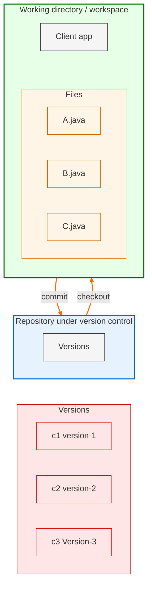

DevOps Cycle is an infinite loop where everything is continuous.

## Version Control System Tools:
Version control systems are also known as:
- Software Configuration Management (SCM)
- Source Code Management (SCM)

## Need for Version Control Systems
- How does a version control system work?
- Benefits of version control systems.

## Types of Version Control Systems
1. Centralized Version Control System (CVCS)
2. Distributed Version Control System (DVCS)

Q. **Difference between CVCS and DVCS**

## Need for Version Control Systems
As developers, we often write several files containing source code. 
- Developer → Write Code → Files

### Client Project Example
- Client provided requirements to Durga to develop a project.
- Client project consists of 100 files developed.
- The client suggested some changes.
- I modified some files' source code to meet the client's requirements.
- I gave a demo, and the client suggested more changes.
- I modified some files' source code again to meet the client's requirements.
- I gave a third demo.
- The client requested the first version only.

### Importance of Version Control
- We should not overwrite our code; every version must be maintained.
1. Maintaining multiple versions manually is a complex activity.
2. If Developer A and Developer B are working on the same code, we need to merge their contributions. If both developers create a file named `Util.java`, one copy will overwrite the other, leading to abnormal behavior.
3. Every change should be tracked, including:
   - Who made the change
   - When the change was made
   - What changes were made
4. Overwriting of code should not happen.
5. Developers must share their code with peers to enable collaborative work.
6. Parallel development is essential.

### How Version Control System Works

Version control system always talks about files which contain source code. Everyone requires a version control system to maintain different versions of their documents. For example:

- Tester: To maintain different versions of test scripts
- Architect: To maintain different versions of documents
- Project Manager: To maintain different versions of Excel sheets, etc.

### The Basic Terminology of Version Control System:

**_Working Directory:_** Where developers are required to create/modify files. Here version control is not applicable. Here we won't use the work like version-1, version-2 etc.

**_Repository:_** Where we have to store files and metadata. Here version control is applicable. Here we can talk about versions like version-1, version-2 etc.

**_Commit:_** The process of sending files from working directory to the repository.

**_Checkout:_** The process of sending files from repository to working directory.

**_Benefits of Version Control System:_**

1. We can maintain different versions and we can choose any version based on client requirement.
2. With every version/commit we can maintain metadata like:
	* commit message
	* who did changes
	* when he did the change
	* what changes he did
3. Developers can share the code to the peer developers in very easy way.
4. Multiple developers can work in collaborative way.
5. Parallel development.
6. We can provide access control like:
	* who can read code
	* who can modify code

## Types of Version Control Systems

There are two types of VCSs:

### 1. _Centralized Version Control System_

* This type contains only one central repository.
* Every developer should be connected to that repository.
* The total project code will be stored in the central repository.
* If there are four developers, there is still only one repository.

This type of VCS is very easy to set up and use. Examples include CVS, SVN, Perforce, TFS, and Clearcase.

  

**_Problems with Centralized VCSs:_**

1. **_Single Point of Failure_**: Central Repository is the only place where everything is stored, making recovery difficult in case of issues.
2. **_Network Dependency_**: All operations require a network connection to the central repository, making version control unavailable during outages.
3. **_Performance Issues_**: Network-based operations can be slow, causing performance problems.
4. **_Complexity_**: Organizing the central repository becomes complex with an increase in developers and files.
5. **Additional Issues**: Other problems may arise, such as...

### 2. _Distributed Version Control Systems_

The name itself indicates that the repository is distributed, and every developer's workspace contains a local copy of the repository. There is no question of a central repository.

If there are 4 developers, then there will be 4 repositories.

**Advantages:**

1. **Local Operations**: The checkout and commit operations are performed locally, resulting in better performance.
2. **Network Independence**: Checkout and commit operations do not require a network connection, ensuring version control remains available during network outages.
3. **Redundancy**: If something goes wrong with any repository, there is a chance for recovery, eliminating the single point of failure concern.
4. **Infrequent Network Use**: Although network connectivity is required for push and pull operations, these operations are not frequent and are performed rarely.

**Operations Overview:**

**Workspace and Repository Operations:**

* Commit: Workspace → Repository
* Checkout: Repository → Workspace

**Repository to Repository Operations:**

* Push: One Repository → Other Repository
* Pull: One Repository ← Other Repository

  

### **_Remote Repository vs Central Repository:_**

1. Each developer has their own local copy of the repository, making it a distributed system.
2. Commit and checkout operations are performed on the local repository, not the remote repository.
3. The primary function of the remote repository is to facilitate sharing of work among peer developers.
4. The popularity of this model can be attributed to its high availability, speed, and lack of a single point of failure.

  

Distributed VCS with Remote Repositoty

**_commit and checkout:_**

- These operations will be performed locally between working directory and
repository.

- To perform these operations network is not required.

**_push & pull operations:_**

- **_push:_** The process of sending files from our repository to other's repository.
- **_pull:_** The process of getting files from other's repository to local repository.

**_Tools:_** GIT, Mercurial, Bazaar, Darcs, Monotone, Fossil, and SourceGear Vault.
