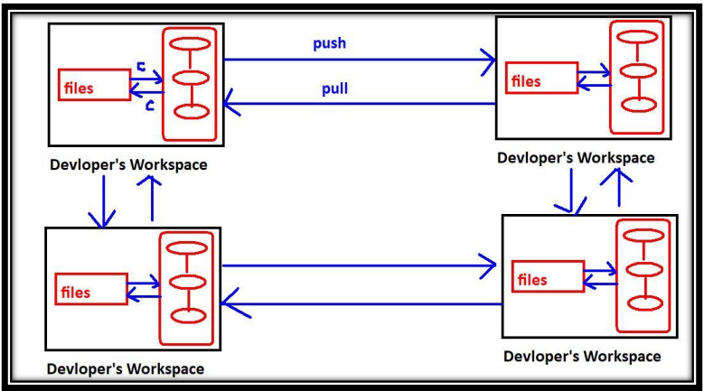

## Types of Version Control Systems

There are two types of VCSs:

### 1. _Centralized Version Control System_

* This type contains only one central repository.
* Every developer should be connected to that repository.
* The total project code will be stored in the central repository.
* If there are four developers, there is still only one repository.

This type of VCS is very easy to set up and use. Examples include CVS, SVN, Perforce, TFS, and Clearcase.

  

**_Problems with Centralized VCSs:_**

1. **_Single Point of Failure_**: Central Repository is the only place where everything is stored, making recovery difficult in case of issues.
2. **_Network Dependency_**: All operations require a network connection to the central repository, making version control unavailable during outages.
3. **_Performance Issues_**: Network-based operations can be slow, causing performance problems.
4. **_Complexity_**: Organizing the central repository becomes complex with an increase in developers and files.
5. **Additional Issues**: Other problems may arise, such as...

### 2. _Distributed Version Control Systems_

The name itself indicates that the repository is distributed, and every developer's workspace contains a local copy of the repository. There is no question of a central repository.

If there are 4 developers, then there will be 4 repositories.

**Advantages:**

1. **Local Operations**: The checkout and commit operations are performed locally, resulting in better performance.
2. **Network Independence**: Checkout and commit operations do not require a network connection, ensuring version control remains available during network outages.
3. **Redundancy**: If something goes wrong with any repository, there is a chance for recovery, eliminating the single point of failure concern.
4. **Infrequent Network Use**: Although network connectivity is required for push and pull operations, these operations are not frequent and are performed rarely.

**Operations Overview:**

**Workspace and Repository Operations:**

* Commit: Workspace → Repository
* Checkout: Repository → Workspace

**Repository to Repository Operations:**

* Push: One Repository → Other Repository
* Pull: One Repository ← Other Repository

  

### **_Remote Repository vs Central Repository:_**

1. Each developer has their own local copy of the repository, making it a distributed system.
2. Commit and checkout operations are performed on the local repository, not the remote repository.
3. The primary function of the remote repository is to facilitate sharing of work among peer developers.
4. The popularity of this model can be attributed to its high availability, speed, and lack of a single point of failure.

  

Distributed VCS with Remote Repositoty

**_commit and checkout:_**

- These operations will be performed locally between working directory and
repository.

- To perform these operations network is not required.

**_push & pull operations:_**

- **_push:_** The process of sending files from our repository to other's repository.
- **_pull:_** The process of getting files from other's repository to local repository.

**_Tools:_** GIT, Mercurial, Bazaar, Darcs, Monotone, Fossil, and SourceGear Vault.
