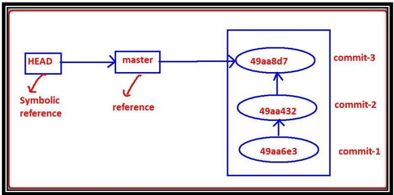

## <font color="red">Git References (master and HEAD)</font>

- For most of the commands, we have to provide a commit ID as an argument. However, remembering a commit ID can be very difficult, even if it's just 7 characters long. 

- Git provides some sample names for these commit IDs, which we can use directly. These are just pointers to commit IDs. These sample names are called references or refs. References are stored in the `.git/refs` directory as text files. 

- There are multiple types of references, including heads, tags, and remotes.


In Git, both **master** and **HEAD** play important roles in tracking and managing commits. Here's a breakdown of these concepts:

## 1. What is `master`?

- **master** is the default branch in a Git repository. It is a **reference (pointer)** to the most recent commit in that branch. You can find this reference stored in `.git/refs/heads/master`.
- For example, the content of `.git/refs/heads/master` is the commit ID `49aa8d79a9bab4c0d72dec217c0c6d5d96d604ce`, which points to the last commit on the master branch.
- Wherever you need to use the most recent commit ID of the `master` branch, you can simply refer to `master`. Git commands like `git show master` and `git show <commit_id>` will produce the same output.

```bash
$ git show master
$ git show 49aa8d7
```

## 2. What is `HEAD`?

- **HEAD** is a symbolic reference that usually points to the current branch's latest commit, typically the `master` branch. It can also point directly to a commit if you're in a detached state (explained below).
- You can think of **HEAD** as a pointer that tells you "where you are" in the repository. By default, `HEAD` points to the branch name, but it can also point to a specific commit if you're not on a branch.
- This reference is stored in the root of the `.git` directory in a file named `HEAD`. The content of the `.git/HEAD` file will look like:

```
ref: refs/heads/master
```

This means `HEAD` is pointing to the `master` branch.

- Example output from `git log --oneline`:

```
49aa8d7 (HEAD -> master) both files added
```

## 3. Detached HEAD

- A **detached HEAD** occurs when `HEAD` is pointing directly to a specific commit rather than to a branch. This can happen if you checkout a specific commit instead of a branch:

```bash
$ git checkout 49aa8d7
```

- When in a detached state, Git is not tracking a branch, and any new commits will not be associated with the branch unless explicitly reattached.




```bash
mkdir project7 && cd project7
git init
cat > file1.txt
git add file1.txt
git commit -m "file1.txt added"
git log
cd .git/
ls
cd refs/
cd heads/
ls
cat master
cd ../..
cat >> file1.txt
git add .
git commit -m "file updated"
git log
cat .git/refs/heads/master
git show master
cat .git/HEAD
git log --oneline
git show HEAD