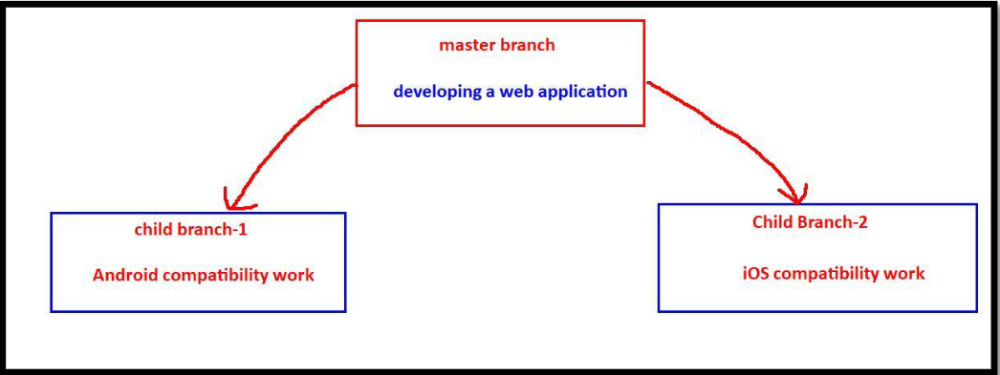
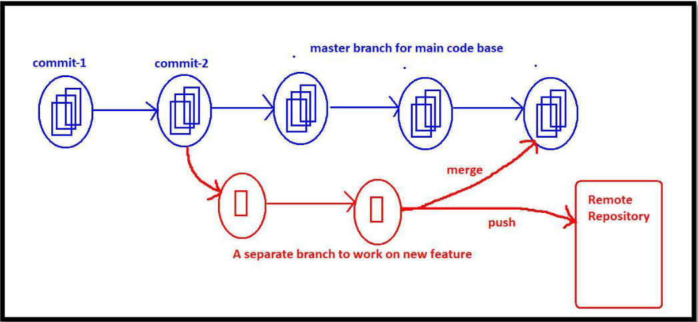
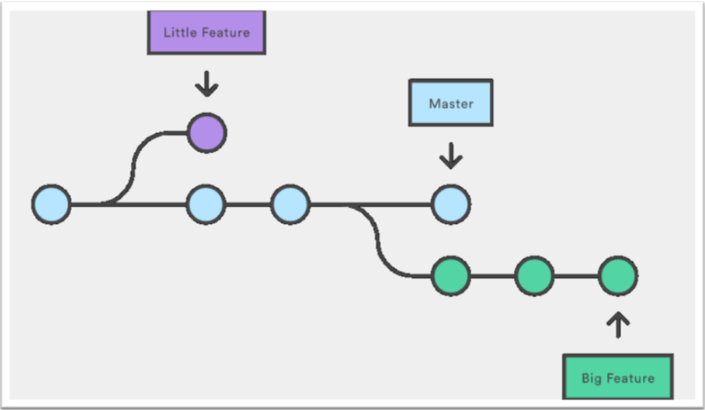

## Branching and Merging

### 1. **What is Branching?**

Branching is a fundamental concept in version control systems like Git. It allows developers to diverge from the main line of development and work independently on new features, bug fixes, or experiments. By default, all work happens on the `master` or `main` branch, which contains the main source code.

### 2. **Need for Creating a New Branch**

Creating a new branch is essential in scenarios where independent work is required. Instead of working directly in the `master` branch, a separate branch allows for isolated changes without affecting the stability of the main branch.

### 3. **Use Cases for Branching**

1. **Feature Development:** Adding new features like user authentication or payment integration.
2. **Bug Fixes:** Isolating critical bug fixes without interfering with ongoing development.
3. **Code Refactoring:** Cleaning up code structure in a separate branch.
4. **Experimentation:** Testing new tools or libraries without affecting production code.
5. **Release Preparation:** Stabilizing code for releases while continuing development in parallel branches.

### 4. **Advantages of Branching**

1. **Parallel Development:** Multiple developers can work on different tasks simultaneously.
2. **Code Isolation:** Changes in one branch do not impact others until merged.
3. **Improved Collaboration:** Teams can work on separate features or fixes independently.
4. **Version Management:** Keeps experimental or incomplete work away from production code.
5. **Easy Rollback:** Unwanted changes can be discarded by deleting the branch.

### Branching in Development

**Master Branch**:  
The primary branch, typically used for production-ready code.

**Branch-1**:  
Dedicated to developing **web application** features.

**Branch-2**:  
Focused on creating **Android compatibility**.

**Branch-3**:  
Handles the development of **iOS compatibility**.

A **branch** is an independent workflow in a version control system. By using the branching concept, developers can create multiple workflows to work on different features or tasks simultaneously without affecting the main codebase. This allows for better collaboration, organization, and management of development efforts.

### Conclusions on Branching

1. **Inheritance of Files and Commits**  
   - When a branch is created, all files and commits are inherited from the parent branch to the child branch.  
   - Branching is essentially a logical duplication of files and commits.  
   - In the child branch, developers can create new files and perform commits as needed without affecting the parent branch.

2. **Isolation Between Branches**  
   - Each branch is **isolated** from the others.  
   - Changes made in the master branch are not visible to a new branch, and vice versa.  
   - This isolation ensures that development in one branch does not interfere with the codebase in another branch.

3. **Merging and Pushing**  
   - After completing work in a new branch, it can be merged back into the main branch (e.g., the master branch).  
   - Alternatively, the branch can be pushed directly to the remote repository for further collaboration or integration.
