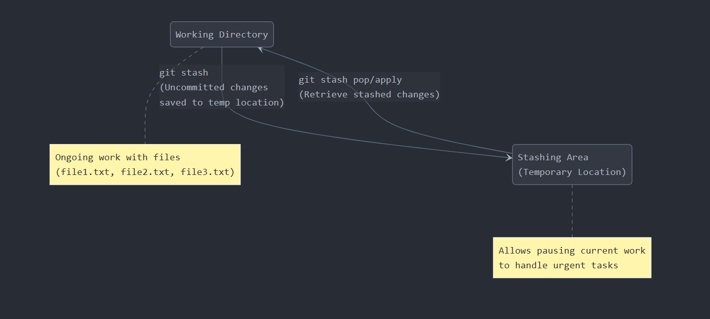

## **Git Stash - An Advanced Concept in GIT**  

### **What is Stash?**  
The term **stash** means storing something safely in a hidden or secure place.  

### **Analogy for Git Stash:**  
Imagine you are working on a document and suddenly need to attend an important meeting. However, your document is unfinished, and you don’t want to lose your progress. Instead of saving it permanently, you temporarily place it in a **drawer** for safekeeping. Once you return, you take it out and continue working.  

Similarly, **Git Stash** allows developers to temporarily store their uncommitted changes and switch branches or work on something else without losing progress. Later, they can retrieve the stashed changes and continue their work.  

#### **Example Scenario:**  
- You are working on **Feature A** but suddenly need to fix a critical bug in **Feature B**.  
- Instead of committing half-done work, you **stash** your changes.  
- After fixing **Feature B**, you retrieve the stashed changes and continue working on **Feature A**.  


### **Analogy 1: Swiss Bank Example**  
Think of **Git Stash** like a **Swiss bank**, where you securely store money for future use. Instead of carrying a huge sum of **100000000000000000 $** around, you deposit it in a **Swiss bank** for safekeeping. Similarly, **Git Stash** temporarily stores your uncommitted changes, allowing you to retrieve them when needed without losing progress.  

### **Analogy 2: Doctor’s Schedule Example**  
Imagine a **doctor performing surgery** from **6 PM to 9 PM**. Suddenly, an **urgent case at 7:30 PM** arises. Instead of abandoning the ongoing operation, the doctor temporarily secures the current procedure, attends to the emergency, and later resumes the initial surgery.  

Similarly, **Git Stash** allows developers to temporarily save their ongoing work, handle urgent tasks (like fixing a critical bug), and then return to the stashed work without losing any progress.
---

--- 


### **What is Git Stash?**  
**Git Stash** is a command used to temporarily save uncommitted changes from the working directory and staging area to a temporary location. This allows developers to switch branches or work on something else without losing progress.  

### **How Git Stash Works:**  
1. **Save Changes Temporarily** → `git stash`  
   - Moves uncommitted changes to a temporary storage area.  
   - The working directory becomes clean.  

2. **Work on Urgent Tasks**  
   - Perform the necessary urgent changes and commit them.  

3. **Restore Saved Changes** → `git stash pop` or `git stash apply`  
   - Retrieve stashed changes and continue working.  

### **Key Commands:**  
- `git stash` → Save uncommitted changes.  
- `git stash list` → View stored stashes.  
- `git stash pop` → Apply the most recent stash and remove it from the list.  
- `git stash apply` → Apply a stash without removing it.  
- `git stash drop` → Delete a specific stash.  

---

1. **Git stash is applicable only for tracked files.** → **Valid**  
   - `git stash` only saves **tracked files** (files that are already added to Git).  
   - **Untracked files** (newly created files not added with `git add`) and **ignored files** (listed in `.gitignore`) are not included by default.  
   - To stash untracked files as well, use:  
     ```sh
     git stash -u  # Stashes untracked files
     git stash -a  # Stashes untracked and ignored files
     ```  

2. **To perform `git stash`, at least one commit should be there.** → **Valid**  
   - `git stash` requires a clean commit history to save changes properly.  
   - If the repository has **no commits**, Git cannot stash changes because there is no reference point to revert to a clean state.  
   - To use `git stash`, make at least one commit:  
     ```sh
     git commit -m "Initial commit"
     git stash
     ```  

---

#### **Step 1: Initialize Git Repository**
```sh
PS D:\VCS\stashing> git init
Initialized empty Git repository in D:/VCS/stashing/.git/
```
- This initializes a new Git repository in the `stashing` directory.

---

#### **Step 2: Create Files and Add Content**
```sh
PS D:\VCS\stashing> wsl
akshay@LAPTOP:/mnt/d/VCS/stashing$ nano file1.txt
akshay@LAPTOP:/mnt/d/VCS/stashing$ nano file2.txt
```
- Creates `file1.txt` and `file2.txt` using the `nano` editor.

---

#### **Step 3: Check Git Status**
```sh
akshay@LAPTOP:/mnt/d/VCS/stashing$ git status
On branch master

Untracked files:
  (use "git add <file>..." to include in what will be committed)
        file1.txt
        file2.txt

nothing added to commit but untracked files present (use "git add" to track)
```
- Git detects untracked files (`file1.txt` and `file2.txt`).

---

#### **Step 4: Add Files to Staging Area**
```sh
akshay@LAPTOP:/mnt/d/VCS/stashing$ git add file1.txt file2.txt
```
- Adds both files to the staging area.

---

#### **Step 5: Commit the Files**
```sh
akshay@LAPTOP:/mnt/d/VCS/stashing$ git commit -m "Initial commit - Added file1.txt and file2.txt"
[master (root-commit) a4cab42] Initial commit - Added file1.txt and file2.txt
 2 files changed, 2 insertions(+)
 create mode 100644 file1.txt
 create mode 100644 file2.txt
```
- Commits the staged files.

---

#### **Step 6: Modify Files and Check Status**
```sh
akshay@LAPTOP:/mnt/d/VCS/stashing$ nano file1.txt
akshay@LAPTOP:/mnt/d/VCS/stashing$ nano file2.txt
```
- Modifies `file1.txt` and `file2.txt` by adding new content.

```sh
akshay@LAPTOP:/mnt/d/VCS/stashing$ git status
On branch master
Changes not staged for commit:
  (use "git add <file>..." to update what will be committed)
  (use "git restore <file>..." to discard changes in working directory)
        modified:   file1.txt
        modified:   file2.txt
```
- Git detects changes in both files.

---

#### **Step 7: Add One File and Check Status**
```sh
akshay@LAPTOP:/mnt/d/VCS/stashing$ git add file2.txt
```
- Stages only `file2.txt`.

```sh
akshay@LAPTOP:/mnt/d/VCS/stashing$ git status
On branch master
Changes to be committed:
  (use "git restore --staged <file>..." to unstage)
        modified:   file2.txt

Changes not staged for commit:
  (use "git add <file>..." to update what will be committed)
  (use "git restore <file>..." to discard changes in working directory)
        modified:   file1.txt
```
- `file2.txt` is staged, but `file1.txt` is still unstaged.

---

#### **Step 8: Stash Changes**
```sh
akshay@LAPTOP:/mnt/d/VCS/stashing$ git stash
Saved working directory and index state WIP on master: a4cab42 2 files added
```
- Saves changes (both staged and unstaged) in the stash.
- The working directory is now clean.

```sh
akshay@LAPTOP:/mnt/d/VCS/stashing$ git status
On branch master
nothing to commit, working tree clean
```
- Confirms the working directory is clean.

---

#### **Step 9: Verify File Contents**
```sh
akshay@LAPTOP:/mnt/d/VCS/stashing$ cat file1.txt
First line in file1.txt
```
```sh
akshay@LAPTOP:/mnt/d/VCS/stashing$ cat file2.txt
First line in file2.txt
```
- Displays the current state of the files (original content restored after stashing).

---

### **Step 10: Perform Urgent Work**
```sh
akshay@LAPTOP:/mnt/d/VCS/stashing$ echo "Urgent work should be completed immediately" > file3.txt
akshay@LAPTOP:/mnt/d/VCS/stashing$ git add file3.txt
akshay@LAPTOP:/mnt/d/VCS/stashing$ git commit -m "Urgent work completed"
[master 495a85e] Urgent work completed
```
- Creates `file3.txt`, stages it, and commits the urgent work.

---

### **Step 11: Restore Stashed Changes**
```sh
akshay@LAPTOP:/mnt/d/VCS/st
```

### **Step 1: Verify Stashed Changes**
```sh
akshay@LAPTOP:/mnt/d/VCS/stashing$ git stash list
```
- Lists all stashed entries.

```sh
akshay@LAPTOP:/mnt/d/VCS/stashing$ cat file1.txt
First line in file1.txt
Work is going on...
```
- Displays the current content of `file1.txt`.

```sh
akshay@LAPTOP:/mnt/d/VCS/stashing$ echo "some more work is going on" >> file1.txt
```
- Appends text to `file1.txt`.

---

### **Step 2: Check Git Status**
```sh
akshay@LAPTOP:/mnt/d/VCS/stashing$ git stuatus
git: 'stuatus' is not a git command. See 'git --help'.

The most similar command is
        status
```
- Incorrect command due to a typo.

```sh
akshay@LAPTOP:/mnt/d/VCS/stashing$ git status
On branch master
Changes not staged for commit:
  (use "git add <file>..." to update what will be committed)
  (use "git restore <file>..." to discard changes in working directory)
        modified:   file1.txt
        modified:   file2.txt

no changes added to commit (use "git add" and/or "git commit -a")
```
- Confirms that `file1.txt` and `file2.txt` have uncommitted changes.

---

### **Step 3: Stash the Changes**
```sh
akshay@LAPTOP:/mnt/d/VCS/stashing$ git stash
Saved working directory and index state WIP on master: 495a85e Urgent work completed
```
- Saves uncommitted changes in the stash.

```sh
akshay@LAPTOP:/mnt/d/VCS/stashing$ git stash list
stash@{0}: WIP on master: 495a85e Urgent work completed
```
- Verifies that the stash was created.

---

### **Step 4: Perform Very Urgent Work**
```sh
akshay@LAPTOP:/mnt/d/VCS/stashing$ echo "Very urgent work" > file4.txt
akshay@LAPTOP:/mnt/d/VCS/stashing$ git add file4.txt
akshay@LAPTOP:/mnt/d/VCS/stashing$ git commit -m "Very urgent work is completed"
[master d01124b] Very urgent work is completed
 1 file changed, 1 insertion(+)
 create mode 100644 file4.txt
```
- Creates `file4.txt`, stages it, and commits the changes.

```sh
akshay@LAPTOP:/mnt/d/VCS/stashing$ git status
On branch master
nothing to commit, working tree clean
```
- Confirms that the working directory is clean.

---

### **Step 5: Verify Stash and Restore Changes**
```sh
akshay@LAPTOP:/mnt/d/VCS/stashing$ git stash list
stash@{0}: WIP on master: 495a85e Urgent work completed
```
- Confirms the presence of the stashed changes.

```sh
akshay@LAPTOP:/mnt/d/VCS/stashing$ git stash apply stash@{0}
On branch master
Changes not staged for commit:
  (use "git add <file>..." to update what will be committed)
  (use "git restore <file>..." to discard changes in working directory)
        modified:   file1.txt
        modified:   file2.txt

no changes added to commit (use "git add" and/or "git commit -a")
```
- Applies the stashed changes without removing the stash entry.

```sh
akshay@LAPTOP:/mnt/d/VCS/stashing$ git stash list
stash@{0}: WIP on master: 495a85e Urgent work completed
```
- Confirms that the stash entry remains.

---

## **Partial Stash**

---

### **What is Partial Stashing?**  
Stashing allows you to temporarily save uncommitted changes without committing them. Partial stashing (`git stash -p`) enables you to select specific changes to stash, rather than stashing all modified files.  

#### **Key Points:**  
1. At least one commit is required before using `git stash`.  
2. Stashing applies only to **tracked** files.  
3. **Full stash:** `git stash` stashes all changes.  
4. **Partial stash:** `git stash -p` lets you choose which changes to stash.  
5. **Restoring changes:**  
   - `git stash pop`: Applies the last stashed changes and removes them from the stash list.  
   - `git stash apply`: Applies the last stashed changes but retains them in the stash list.  

---

### **Step 1: Initialize Git and Make a Commit**
```sh
akshay@LAPTOP:/mnt/d/VCS/partialstashing$ echo "First Line" > file1.txt
akshay@LAPTOP:/mnt/d/VCS/partialstashing$ echo "First Line" > file2.txt
akshay@LAPTOP:/mnt/d/VCS/partialstashing$ git add .
akshay@LAPTOP:/mnt/d/VCS/partialstashing$ git commit -m "first commit"
```
- Creates `file1.txt` and `file2.txt` with initial content.
- Adds the files to Git and commits them.

---

### **Step 2: Modify Files**
```sh
akshay@LAPTOP:/mnt/d/VCS/partialstashing$ echo "Working is going on" >> file1.txt
akshay@LAPTOP:/mnt/d/VCS/partialstashing$ echo "Working is going on" >> file2.txt
```
- Appends text to both files.

```sh
akshay@LAPTOP:/mnt/d/VCS/partialstashing$ git status
```
- Shows that both files are modified.

```sh
akshay@LAPTOP:/mnt/d/VCS/partialstashing$ cat file1.txt
First Line
Working is going on
```
- Verifies the changes in `file1.txt`.

---

### **Step 3: Perform Partial Stashing**
```sh
akshay@LAPTOP:/mnt/d/VCS/partialstashing$ git stash -p
```
- Starts **interactive** stashing, allowing you to choose file modifications to stash.

#### **Interactive Prompt (User Choices)**
```
(1/1) Stash this hunk [y,n,q,a,d,e,?]? y
```
- **y** (yes) → Stashes changes in `file1.txt`.  
- **n** (no) → Keeps changes in `file2.txt`.  

```sh
Saved working directory and index state WIP on master: a1acdb1 first commit
```
- Only `file1.txt` is stashed.

---

### **Step 4: Verify the Partial Stash**
```sh
akshay@LAPTOP:/mnt/d/VCS/partialstashing$ git status
```
- `file2.txt` still has uncommitted changes.  
- `file1.txt` is restored to its original committed state.

```sh
akshay@LAPTOP:/mnt/d/VCS/partialstashing$ git stash list
stash@{0}: WIP on master: a1acdb1 first commit
```
- Shows the saved stash entry.

```sh
akshay@LAPTOP:/mnt/d/VCS/partialstashing$ git show stash@{0}
```
- Displays details of the stashed changes.

```sh
akshay@LAPTOP:/mnt/d/VCS/partialstashing$ cat file1.txt
First Line
```
- Confirms that `file1.txt` is restored to its original state.

```sh
akshay@LAPTOP:/mnt/d/VCS/partialstashing$ cat file2.txt
First Line
Working is going on
```
- Confirms that `file2.txt` still has uncommitted changes.

---

### **Step 5: Complete Urgent Work**
```sh
akshay@LAPTOP:/mnt/d/VCS/partialstashing$ echo "some urgent work" > file3.txt
akshay@LAPTOP:/mnt/d/VCS/partialstashing$ git add .
akshay@LAPTOP:/mnt/d/VCS/partialstashing$ git commit -m "urgent work completed"
```
- Adds a new file (`file3.txt`) and commits it.

```sh
akshay@LAPTOP:/mnt/d/VCS/partialstashing$ git status
On branch master
nothing to commit, working tree clean
```
- Confirms that all changes are committed.

---

### **Step 6: Restore Stashed Changes**
```sh
akshay@LAPTOP:/mnt/d/VCS/partialstashing$ git stash list
stash@{0}: WIP on master: a1acdb1 first commit
```
- Confirms that the stash is still present.

```sh
akshay@LAPTOP:/mnt/d/VCS/partialstashing$ git stash pop stash@{0}
```
- Applies the stashed changes and **removes** the entry from the stash list.

```sh
On branch master
Changes not staged for commit:
  (use "git add <file>..." to update what will be committed)
  (use "git restore <file>..." to discard changes in working directory)
        modified:   file1.txt

no changes added to commit (use "git add" and/or "git commit -a")
Dropped stash@{0}
```
- Confirms that `file1.txt` changes are restored.

---

### **Conclusion**
- **Partial stashing (`git stash -p`)** lets you selectively stash changes.  
- **Full stashing (`git stash`)** stashes all changes.  
- **Stash restoration:**
  - `git stash pop` restores changes and deletes the stash.
  - `git stash apply` restores changes but keeps the stash entry.

