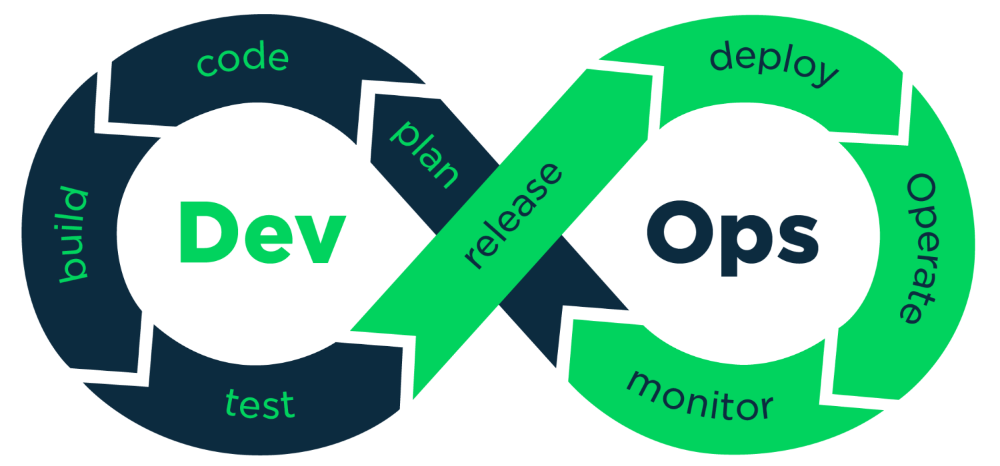
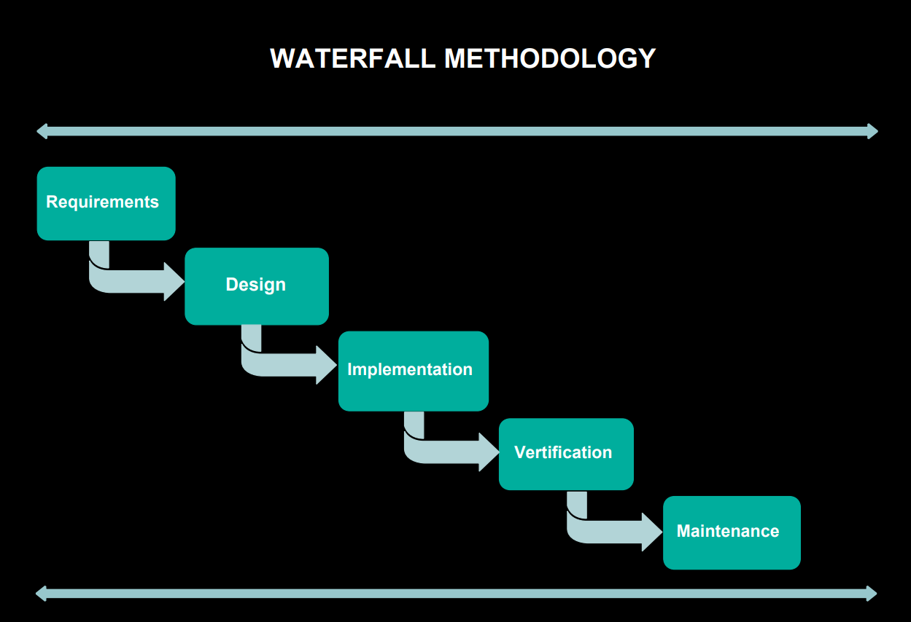
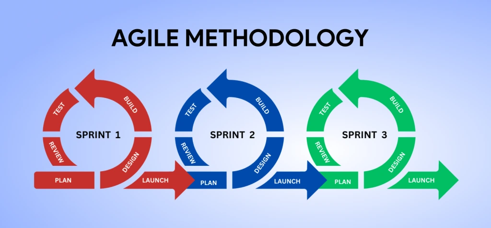
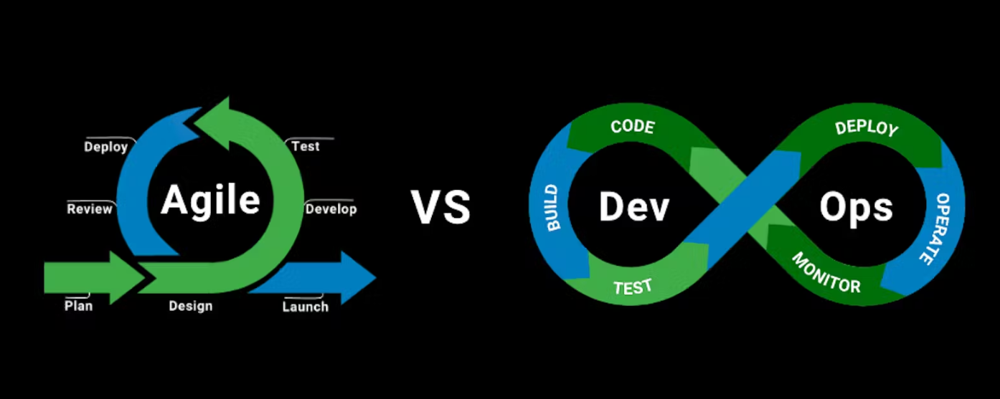
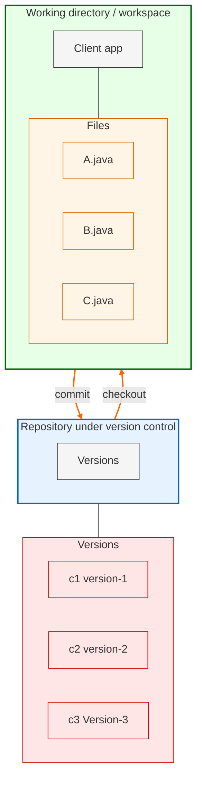
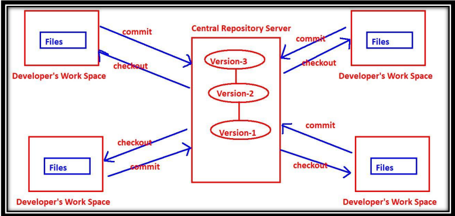
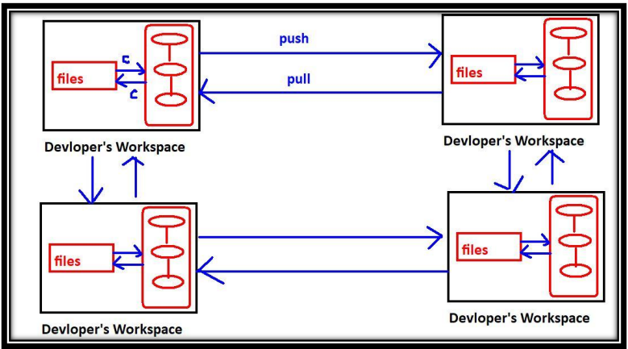
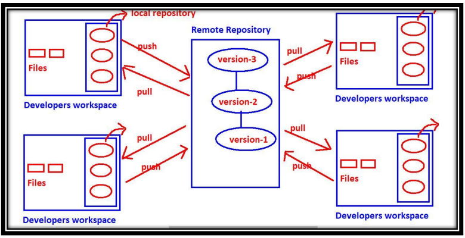

# 1: Introduction to DevOps

## 1.1 What is DevOps?

- DevOps is not a new tool or technology in the market.
- It is a new culture or process to develop, release, and maintain software products, projects, and applications with high quality in a faster way.
- This is achieved in DevOps by using several automation tools.
- For any software development, release, and maintenance, there are two main groups of engineers in a company:
  1. **Development Group**
  2. **Non-Development Group** (or Operations Group or Administrators Group)

### Development Group

The people involved in the following activities are considered part of the Development Group:
1. Planning
2. Coding
3. Build
4. Testing

### Example Roles in Development Group

- Business Analyst (BA)
- System Analyst (SA)
- Design Architect (DA)
- Developers/Coders
- Build Engineer
- Test Engineers/QA

### 2 Operations Group

The people involved in the following activities are considered part of the Operations Group:
1. Release
2. Deploy
3. Operate
4. Monitor

### Example Roles in Operations Group

- Release Engineers
- Configuration Engineer
- System Admin
- Database Admin
- Network Admin

DevOps is a combination of development and operations. The main objective of DevOps is to implement collaboration between development and operations teams.

<p align="center">
  
</p>

To understand the new DevOps culture, it's essential to be aware of the existing Software Development Life Cycle (SDLC) models:

1. **Waterfall Model**
2. **Prototype Model**
3. **Incremental/Iterative Model**
4. **Spiral Model**
5. **RAD Model**
6. **Big-Bang Model**
7. **Fish Model**
8. **V Model**
9. **Agile Model**
10. **DevOps Culture**


## 1.2 Water Fall Model:

<p align="center">
  
</p>


### Advantages:
1. It is very simple and easy to implement. 
2. Phases won't be overlapped and hence there is no ambiguity. 
3. All phases will be executed one by one, which gives high visibility to the project managers and clients about the progress of the project. 
4. Best suitable if the requirements are fixed. 
5. Best suitable for small projects.  

### Disadvantages:
1. It is a very rigid model because it won't accept requirement changes in the middle. 
2. Client satisfaction is very low because most of the time the client will add new requirements in the middle, which won't be supported. 
3. Total project development time is more because testing should be done after completing development only. 
4. The cost of bug fixing is very high because we cannot identify bugs in the early stages of the life cycle. 
5. Not suitable if the requirements keep on changing. 
6. Not suitable for large projects.


## 1.3 **Agile Model**:  
This is the most frequently used and popular model for software development. The Agile Model is divided into several sub-models:  
1. Rational Unified Process (RUP)  
2. Adaptive Software Development (ASD)  
3. Feature Driven Development (FDD)  
4. Crystal Clear  
5. Dynamic Software Development Method (DSDM)  
6. Extreme Programming (XP)  
7. Scrum  
   

<p align="center">
  
</p>


Among all these models, the Scrum model is the most popular and frequently used. Scrum is derived from the Rugby game.

- It is a lightweight process.
- It is an iterative/incremental model and it accepts changes very easily.
- It is a people-based model, not a plan-based model.
- Team collaboration and continuous feedback are strengths of this model.

## 1.4 **Waterfall vs Scrum**:  
1. In the Waterfall model, before starting the next phase, the previous phase should be completed. It is a very rigid model and won't accept requirement changes in the middle.  
2. But the Scrum model is not a linear sequential model. It is an iterative model. The total software will be developed increment by increment, and each increment is called a sprint. A sprint is a deliverable/shippable product in the Scrum model.

**Points to Remember**:  
1. Scrum is an agile model that allows us to focus on delivering the highest quality software in the shortest time.  
2. In this model, software development follows an increment-by-increment approach.  
3. Each increment will take one to three weeks.  
4. Seven to nine members are responsible for every sprint. The art of doing twice the work in half the time is nothing but the Scrum model — Jeff Sutherland.  

**Advantages of Scrum Model**:  
1. There is a maximum chance for quality.  
2. It ensures effective use of time and money.  
3. Requirement changes will be accepted, providing maximum chances for client satisfaction.  
4. There is a possibility of client involvement at every stage.  
- It is a lightweight process.  
- It is an iterative/incremental model and it accepts changes very easily.  
- It is a people-based model, not a plan-based model.  
- Team collaboration and continuous feedback are strengths of this model.  
5. Project status tracking is very easy.  
6. Teams get complete visibility through scrum meetings.  

**Limitations**:  
1. The chances of project failure are very high if individuals are not committed or cooperative.  
2. Adapting the Scrum model for large teams is a big challenge.  
3. An experienced and efficient team is required.  
4. If any team member leaves in the middle of the project, it can have a huge negative impact.  

## 1.5 **DevOps vs Agile Models**:  
DevOps and Agile are not the same.

**Similarities**:  
1. Both are software development methodologies. Agile has been in the market for the last 20 years, but DevOps is a recent methodology.  
2. Both models concentrate on the rapid development of software projects.  

**Differences**:  
1. The differences between these models start after the development of the project. Agile methodology always focuses on software development, testing, and deployment. Once deployment is completed, Agile methodology has no role. But the DevOps model continues after deployment and is also responsible for operations and monitoring.  
2. In the Agile Model, separate people are responsible for developing, testing, and deploying the software. But in DevOps, the DevOps engineer is responsible for everything—from development to operations and operations back to development.  
3. The Agile model doesn't require automation tools. However, the DevOps model is completely based on automation.  
4. The Agile model always gives the highest priority to speed, whereas DevOps gives priority to both speed and automation.  
5. In Agile, the client is responsible for providing feedback for the sprint. In DevOps, immediate feedback is available from monitoring tools.


<p align="center">
  
</p>

DevOps Cycle is an infinite loop where everything is continuous.

## Version Control System Tools:
Version control systems are also known as:
- Software Configuration Management (SCM)
- Source Code Management (SCM)

## Need for Version Control Systems
- How does a version control system work?
- Benefits of version control systems.

## Types of Version Control Systems
1. Centralized Version Control System (CVCS)
2. Distributed Version Control System (DVCS)

Q. **Difference between CVCS and DVCS**

## Need for Version Control Systems
As developers, we often write several files containing source code. 
- Developer → Write Code → Files

### Client Project Example
- Client provided requirements to Durga to develop a project.
- Client project consists of 100 files developed.
- The client suggested some changes.
- I modified some files' source code to meet the client's requirements.
- I gave a demo, and the client suggested more changes.
- I modified some files' source code again to meet the client's requirements.
- I gave a third demo.
- The client requested the first version only.

### Importance of Version Control
- We should not overwrite our code; every version must be maintained.
1. Maintaining multiple versions manually is a complex activity.
2. If Developer A and Developer B are working on the same code, we need to merge their contributions. If both developers create a file named `Util.java`, one copy will overwrite the other, leading to abnormal behavior.
3. Every change should be tracked, including:
   - Who made the change
   - When the change was made
   - What changes were made
4. Overwriting of code should not happen.
5. Developers must share their code with peers to enable collaborative work.
6. Parallel development is essential.


### How Version Control System Works

Version control system always talks about files which contain source code. Everyone requires a version control system to maintain different versions of their documents. For example:

- Tester: To maintain different versions of test scripts
- Architect: To maintain different versions of documents
- Project Manager: To maintain different versions of Excel sheets, etc.




### The Basic Terminology of Version Control System:

**_Working Directory:_** Where developers are required to create/modify files. Here version control is not applicable. Here we won't use the work like version-1, version-2 etc.

**_Repository:_** Where we have to store files and metadata. Here version control is applicable. Here we can talk about versions like version-1, version-2 etc.

**_Commit:_** The process of sending files from working directory to the repository.

**_Checkout:_** The process of sending files from repository to working directory.

**_Benefits of Version Control System:_**

1. We can maintain different versions and we can choose any version based on client requirement.
2. With every version/commit we can maintain metadata like:
	* commit message
	* who did changes
	* when he did the change
	* what changes he did
3. Developers can share the code to the peer developers in very easy way.
4. Multiple developers can work in collaborative way.
5. Parallel development.
6. We can provide access control like:
	* who can read code
	* who can modify code

## Types of Version Control Systems

There are two types of VCSs:

### 1. _Centralized Version Control System_

* This type contains only one central repository.
* Every developer should be connected to that repository.
* The total project code will be stored in the central repository.
* If there are four developers, there is still only one repository.

This type of VCS is very easy to set up and use. Examples include CVS, SVN, Perforce, TFS, and Clearcase.

<p align="center">
  
</p>


**_Problems with Centralized VCSs:_**

1. **_Single Point of Failure_**: Central Repository is the only place where everything is stored, making recovery difficult in case of issues.
2. **_Network Dependency_**: All operations require a network connection to the central repository, making version control unavailable during outages.
3. **_Performance Issues_**: Network-based operations can be slow, causing performance problems.
4. **_Complexity_**: Organizing the central repository becomes complex with an increase in developers and files.
5. **Additional Issues**: Other problems may arise, such as...

### 2. _Distributed Version Control Systems_

The name itself indicates that the repository is distributed, and every developer's workspace contains a local copy of the repository. There is no question of a central repository.

If there are 4 developers, then there will be 4 repositories.

**Advantages:**

1. **Local Operations**: The checkout and commit operations are performed locally, resulting in better performance.
2. **Network Independence**: Checkout and commit operations do not require a network connection, ensuring version control remains available during network outages.
3. **Redundancy**: If something goes wrong with any repository, there is a chance for recovery, eliminating the single point of failure concern.
4. **Infrequent Network Use**: Although network connectivity is required for push and pull operations, these operations are not frequent and are performed rarely.

**Operations Overview:**

**Workspace and Repository Operations:**

* Commit: Workspace → Repository
* Checkout: Repository → Workspace

**Repository to Repository Operations:**

* Push: One Repository → Other Repository
* Pull: One Repository ← Other Repository

<p align="center">
  
</p>

### **_Remote Repository vs Central Repository:_**

1. Each developer has their own local copy of the repository, making it a distributed system.
2. Commit and checkout operations are performed on the local repository, not the remote repository.
3. The primary function of the remote repository is to facilitate sharing of work among peer developers.
4. The popularity of this model can be attributed to its high availability, speed, and lack of a single point of failure.


<p align="center">
  
</p>

<p align="center">Distributed VCS with Remote Repositoty</p>

**_commit and checkout:_**

- These operations will be performed locally between working directory and
repository.

- To perform these operations network is not required.

**_push & pull operations:_**

- **_push:_** The process of sending files from our repository to other's repository.
- **_pull:_** The process of getting files from other's repository to local repository.

**_Tools:_** GIT, Mercurial, Bazaar, Darcs, Monotone, Fossil, and SourceGear Vault.

# Features and Architecture of GIT

### _What is GIT?_

- Git is a Distributed Version Control System Tool.
- Git is not an acronym, but most people abbreviate it as "Global Information Tracker".
- GIT was developed by Linus Torvalds, a Finnish software engineer, who also developed the Linux Kernel.
- Many companies, including Microsoft, Facebook, Yahoo, LinkedIn, and Intel, use Git as their Version Control System Tool.

### _Features of GIT_

Git is very popular due to the following features:

### **_Distributed_**

Git is developed based on Distributed Version Control System Architecture. This architecture offers several advantages:

1. Every Developer has their own local repository, allowing all operations to be performed locally without needing a constant connection to the remote repository.
2. Performing all operations locally results in high performance when compared with other VCSs, making it very fast.
3. Most operations are local, enabling offline work most of the time.
4. The presence of every Developer's own local repository ensures there is no single point of failure.
5. This feature enables parallel development and automatic backups, allowing multiple developers to work on different aspects of a project simultaneously and ensuring all changes are automatically backed up.


### 2. _Staging Area_

- The staging area is also known as the index area. It is a logical layer or virtual layer in Git between the working directory and the local repository. The workflow is as follows:

1. Working Directory → Staging Area → Local Repository

- We cannot commit files directly from the working directory. First, we need to add them to the staging area and then commit them. This staging area is helpful for double-checking or cross-checking our changes before committing them. This type of layer is not available in other Version Control System Tools like CVS, SVN, etc.

- Git stores files in the repository in a hashed form, which saves space. Git uses an internal snapshot mechanism for this. All these conversions and snapshots of our data happen in the staging area before committing.

- For example, if a sample repository takes around 12 GB of space in SVN, it takes hardly 420 MB in Git.

- Hence, the Staging Area is one of the most important strengths of Git.

### 3. _Branching and Merging_

We can create and work on multiple branches simultaneously, and all these branches are isolated from each other. This enables multiple workflows. We can merge multiple branches into a single branch. We can also commit branch-wise.

### 4. _Moving Files_

Moving files in Git is very easy as Git automatically tracks the moves. In contrast, in other VCS, we need to create a new file and then delete the old one.

### 5. _Freeware and Open Source_

Git is freeware and open source.

### 6. _Multi-Platform Support_

Git provides support for multiple platforms.

## _Architecture of GIT_


**_Git contains 2 types of repositories:_**
1. *Local Repository* 
2. *Remote Repository*
   
- For every developer, a separate local repository is available. Developer can perform all 
checkout and commit operations wrt local repository only.

- To perform commit operation, first he has to add files to staging area by using `git add`
command, and then he has to commit those changes to the local repository by using `git commit`
command. Hence commit in GIT is a 2-step process.

- Commit is applicable only for staging area files but not for working directory files.
- If the developer wants to share his work to the peer developers then he has to push his 
local repository to the remote repository by using `git push` command.

- Remote repository contains total project code, which can be accessible by all developers.
- New developer can get local repository by cloning remote repository. For this we have to 
use `git clone` command.

- A developer can get updates from the remote repository to the local repository by using 
`git pull` command.


- `git add` → To add files from working directory to staging area.
- `git commit` → To commit changes from staging area to local repository.
- `git push` → To move files from local repository to remote repository.
- `git clone` → To create a new local repository from the remote repository.
- `git pull` → To get updated files from remote repository to local repository.


## **_Life Cycle of File in GIT:_**

<!--  -->

1. **Untracked** → File is not tracked by git.
2. **Tracked** → File is tracked by git.
    - **Staged** → File is in staging area.
    - **Committed** → File is in local repository.
    
**_Every file in GIT is in one of the following states:_**

1. **Untracked**:
   The files which are newly created in the working directory and git does not aware of these files are said to be in untracked state.
   `git status` → to check the status of the file in all areas.

2. **Staged**:
   - The files which are added to the staging area are said to be in staged state.
   - These files are ready for commit.
   - `git add <file-name>` → to add the file to the staging area.
   - `git add .` → to add all the files to the staging area
   - Example: 
   - `git add a.txt`
   - `git add .`
   - `git add a.txt b.txt c.txt`
   - `git add *.txt`

3. **In Repository/ Committed**:
   Any file which is committed is said to be In Repository/Committed State.

4. **Modified**:
   Any file which is already tracked by git, but it is modified in the working directory is said to be in Modified State.


**Created a file in working directory with some content** → **Untracked**

**Once we add this file to staging area** → **Staged State**

`git add a.txt`

**We have to commit changes from staged area to local repository** → **In Repository/Committed state**

`git commit -m "commit message"`


**If the file is added to the staging area or committed, it is tracked by git.**

`ls`: It will list all files in the working directory. This is a Linux command.

`git ls-files`: It will list all files that are tracked by git, and it is a git command.

## Git Installation On Windows

1. Download and install Git from the [official website](https://git-scm.com/download/win).
2. During installation, choose the option to add Git to the system PATH.
3. Open Git Bash and verify the installation by running:
   ```bash
   git --version
   ```  

## Setting Up Git

1. **Configure Git Username and Email:**
   - Set your name:
     ```bash
     git config --global user.name "Your Name"
     ```
   - Set your email:
     ```bash
     git config --global user.email "your.email@example.com"    

2. **Configure Git Editor:**
   - Set your preferred editor (e.g., nano):
     ```bash
     git config --global core.editor nano
     ```


```bash
Akshay@LAPTOP-5MJVV5PN MINGW64 ~/Documents/ALLFolders/Git DurgaSoft (main)
$ cd project1/
(base)
Akshay@LAPTOP-5MJVV5PN MINGW64 ~/Documents/ALLFolders/Git DurgaSoft/project1 (main)
$ git init
Initialized empty Git repository in C:/Users/Akshay/Documents/ALLFolders/Git DurgaSoft/project1/.git/
(base)
Akshay@LAPTOP-5MJVV5PN MINGW64 ~/Documents/ALLFolders/Git DurgaSoft/project1 (master)
```

`git init`: It initializes a new Git repository in the current directory.


```bash
Akshay@LAPTOP-5MJVV5PN MINGW64 ~/Documents/ALLFolders/Git DurgaSoft/project1 (master)
$ git
usage: git [-v | --version] [-h | --help] [-C <path>] [-c <name>=<value>]
           [--exec-path[=<path>]] [--html-path] [--man-path] [--info-path]
           [-p | --paginate | -P | --no-pager] [--no-replace-objects] [--bare]
           [--git-dir=<path>] [--work-tree=<path>] [--namespace=<name>]
           [--super-prefix=<path>] [--config-env=<name>=<envvar>]
           <command> [<args>]

These are common Git commands used in various situations:

start a working area (see also: git help tutorial)
   clone     Clone a repository into a new directory
   init      Create an empty Git repository or reinitialize an existing one

work on the current change (see also: git help everyday)
   add       Add file contents to the index
   mv        Move or rename a file, a directory, or a symlink
   restore   Restore working tree files
   rm        Remove files from the working tree and from the index

examine the history and state (see also: git help revisions)
   bisect    Use binary search to find the commit that introduced a bug
   diff      Show changes between commits, commit and working tree, etc
   grep      Print lines matching a pattern
   log       Show commit logs
   show      Show various types of objects
   status    Show the working tree status

grow, mark and tweak your common history
   branch    List, create, or delete branches
   commit    Record changes to the repository
   merge     Join two or more development histories together
   rebase    Reapply commits on top of another base tip
   reset     Reset current HEAD to the specified state
   switch    Switch branches
   tag       Create, list, delete or verify a tag object signed with GPG

collaborate (see also: git help workflows)
   fetch     Download objects and refs from another repository
   pull      Fetch from and integrate with another repository or a local branch
   push      Update remote refs along with associated objects

'git help -a' and 'git help -g' list available subcommands and some
concept guides. See 'git help <command>' or 'git help <concept>'
to read about a specific subcommand or concept.
See 'git help git' for an overview of the system.
(base)
```

```bash
Akshay@LAPTOP-5MJVV5PN MINGW64 ~/Documents/ALLFolders/Git DurgaSoft/project1 (master)
$ git status
On branch master

No commits yet

nothing to commit (create/copy files and use "git add" to track)
(base)
```


```bash
Akshay@LAPTOP-5MJVV5PN MINGW64 ~/Documents/ALLFolders/Git DurgaSoft/project1/project2 (master)
$ ls
a.txt  b.txt
(base)
Akshay@LAPTOP-5MJVV5PN MINGW64 ~/Documents/ALLFolders/Git DurgaSoft/project1/project2 (master)
$ git ls-files
(base)
```

```bash
Akshay@LAPTOP-5MJVV5PN MINGW64 ~/Documents/ALLFolders/Git DurgaSoft/project1/project2 (master)
$ git status
On branch master

No commits yet

Untracked files:
  (use "git add <file>..." to include in what will be committed)
        a.txt
        b.txt

nothing added to commit but untracked files present (use "git add" to track)
(base)
Akshay@LAPTOP-5MJVV5PN MINGW64 ~/Documents/ALLFolders/Git DurgaSoft/project1/project2 (master)
$ git add .
(base)
Akshay@LAPTOP-5MJVV5PN MINGW64 ~/Documents/ALLFolders/Git DurgaSoft/project1/project2 (master)
$ git status
On branch master

No commits yet

Changes to be committed:
  (use "git rm --cached <file>..." to unstage)
        new file:   a.txt
        new file:   b.txt

(base)
```


```bash
Akshay@LAPTOP-5MJVV5PN MINGW64 ~/Documents/ALLFolders/Git DurgaSoft/project1/project2 (master)
$ git log
fatal: your current branch 'master' does not have any commits yet
(base)
Akshay@LAPTOP-5MJVV5PN MINGW64 ~/Documents/ALLFolders/Git DurgaSoft/project1/project2 (master)
$ git commit -m "Added a.txt and b.txt"
[master (root-commit) 8a716ad] Added a.txt and b.txt
 2 files changed, 0 insertions(+), 0 deletions(-)
 create mode 100644 a.txt
 create mode 100644 b.txt
(base)
Akshay@LAPTOP-5MJVV5PN MINGW64 ~/Documents/ALLFolders/Git DurgaSoft/project1/project2 (master)
$ git ls-files
a.txt
b.txt
(base)
Akshay@LAPTOP-5MJVV5PN MINGW64 ~/Documents/ALLFolders/Git DurgaSoft/project1/project2 (master)
$ git log
commit 8a716ad2832d2d63608585f5ca1176ecdca42435 (HEAD -> master)
Author: Akshayredekar07 <akshayredekar1414@gmail.com>
Date:   Sun Sep 22 10:12:55 2024 +0530

    Added a.txt and b.txt
(base)
Akshay@LAPTOP-5MJVV5PN MINGW64 ~/Documents/ALLFolders/Git DurgaSoft/project1/project2 (master)
$ git status
On branch master
nothing to commit, working tree clean
(base)
```

```bash
Akshay@LAPTOP-5MJVV5PN MINGW64 ~/Documents/ALLFolders/Git DurgaSoft/project1/project2 (master)
$ git init
Reinitialized existing Git repository in C:/Users/Akshay/Documents/ALLFolders/Git DurgaSoft/project1/project2/.git/
(base)
```


```
git init
git add a.txt b.txt
git commit -m 'commit message'

git add a.txt b.txt
git commit -m 'commit message'
```
```shell
git commit -a -m 'commit message'
```

## The Basic Git Commands With Example:

`init`, `status`, `add`, `commit`, `log` and `config`


### 1. `git init` - Initialize a new Git repository in the current directory.

Once we create a workspace, if we want version control, then we require a local repository. To create that local repository, we have to use the `git init` command.
```bash
$ git init
Initialized empty Git repository in Akshay@LAPTOP-5MJVV5PN MINGW64 ~/Documents/ALLFolders/Git DurgaSoft/project1/project2/.git/
```
`.git` is an empty repository, which is a hidden directory.


### 2. `git status` - Show the working tree status.

It shows the current status of all files in each area, like 
- untracked files
- modified files
- staged files
- committed files

```bash
$ git status
On branch master
Changes not staged for commit:
  (use "git add <file>..." to update what will be committed)
  (use "git restore <file>..." to discard changes in working directory)
  modified:   a.txt
  modified:   b.txt
no changes added to commit (use "git add" and/or "git commit -a")
Note: We can get concise information by using -s option.

**To get concise information:**
```bash
$ git status -s
M  a.txt
M  b.txt
A  c.txt
```

```bash
Akshay@LAPTOP-5MJVV5PN MINGW64 ~/Documents/ALLFolders/Git DurgaSoft/project1/project2 (master)
$ touch c.txt
(base)
Akshay@LAPTOP-5MJVV5PN MINGW64 ~/Documents/ALLFolders/Git DurgaSoft/project1/project2 (master)
$ touch abc.java
(base)
Akshay@LAPTOP-5MJVV5PN MINGW64 ~/Documents/ALLFolders/Git DurgaSoft/project1/project2 (master)
$ ls
a.txt  abc.java  b.txt  c.txt
(base)
Akshay@LAPTOP-5MJVV5PN MINGW64 ~/Documents/ALLFolders/Git DurgaSoft/project1/project2 (master)
$ git status
On branch master
Untracked files:
  (use "git add <file>..." to include in what will be committed)
        abc.java
        c.txt

nothing added to commit but untracked files present (use "git add" to track)
(base)
Akshay@LAPTOP-5MJVV5PN MINGW64 ~/Documents/ALLFolders/Git DurgaSoft/project1/project2 (master)
$ git status -s
?? abc.java
?? c.txt
(base)

```

### 3. `git add` - Add file contents to the index.

- To add files from the working directory to the staging area for tracking/committing purposes, we 
have to use the `git add` command.

**Adding Files to the Staging Area**

To add all files in the current working directory:
```bash
git add .
git add *
git add -A
```
To add specific files:
```bash
git add a.txt
git add a.txt b.txt
git add file1.txt file2.txt
```
To use regular expression patterns:
```bash
git add *.txt
git add *.java
git add *.txt *.java
```  


**Note:**
- staging area: --> index ar  ea or chche area
- It is logical/virtual area but not a physical area.


 

 ### 4. `git commit` 
 - If we want to stage changes and commit them in one command, then we can use `git commit -a` command.


For every commit, a unique commit ID will be generated. It is a 40-character hexadecimal string. 


```bash
Akshay@LAPTOP-5MJVV5PN MINGW64 ~/Documents/ALLFolders/Git DurgaSoft/project1/project2 (master)
$ git add .
(base)
Akshay@LAPTOP-5MJVV5PN MINGW64 ~/Documents/ALLFolders/Git DurgaSoft/project1/project2 (master)
$ git commit -m "abc.java added"
[master d9829f2] abc.java added
 2 files changed, 0 insertions(+), 0 deletions(-)
 create mode 100644 abc.java
 create mode 100644 c.txt
(base)
```

```bash
Akshay@LAPTOP-5MJVV5PN MINGW64 ~/Documents/ALLFolders/Git DurgaSoft/project1/project2 (master)
$ git log
commit d9829f2591ac9f2d0081aa457ee9372838ecdbaa (HEAD -> master)
Author: Akshayredekar07 <akshayredekar1414@gmail.com>
Date:   Sun Sep 22 11:05:00 2024 +0530

    abc.java added

commit 8a716ad2832d2d63608585f5ca1176ecdca42435
Author: Akshayredekar07 <akshayredekar1414@gmail.com>
Date:   Sun Sep 22 10:12:55 2024 +0530

    Added a.txt and b.txt
(base)

```

```bash
echo -n "8a716ad2832d2d63608585f5ca1176ecdca42435" | wc -c

Akshay@LAPTOP-5MJVV5PN MINGW64 ~/Documents/ALLFolders/Git DurgaSoft/project1/project2 (master)
$ echo -n "8a716ad2832d2d63608585f5ca1176ecdca42435" | wc -c
40
```
- The first 7 characters are also unique, and we can identify a commit using them. This unique ID is considered a hash, which is generated based on the content of files.

**_The advantages of this hash are:_**

1. Data inside our local repository is more secure.
2. Git requires less space to store the contents of files. (For example, if an SVN repository required 12GB, but for the same content, Git requires 420MB)

When using the `git commit` command, a commit message is mandatory.

```bash
git commit -m "commit message"
```

```bash
git add file1.txt
git commit -m "file1.txt got modified"

git commit -m 'commit message'
git commit -a -m "file1.txt got modified"
```

```bash
Akshay@LAPTOP-5MJVV5PN MINGW64 ~/Documents/ALLFolders/Git DurgaSoft/project1/project2 (master)
$ cat >> c.txt
This is extra content added in file.
(base)
Akshay@LAPTOP-5MJVV5PN MINGW64 ~/Documents/ALLFolders/Git DurgaSoft/project1/project2 (master)
$ git status
On branch master
Changes not staged for commit:
  (use "git add <file>..." to update what will be committed)
  (use "git restore <file>..." to discard changes in working directory)
        modified:   c.txt

no changes added to commit (use "git add" and/or "git commit -a")
(base)

Akshay@LAPTOP-5MJVV5PN MINGW64 ~/Documents/ALLFolders/Git DurgaSoft/project1/project2 (master)
$ git commit -m "c.txt modified"
[master 0f4f830] c.txt modified
 1 file changed, 1 insertion(+)
(base)

```


create mode 100644 file1.txt<br>
create mode 100644 file2.txt

The 100644 mode indicates the following permissions:

```plaintext
644 --> file permissions: rw-r--r--
- r --> read(4)
- w --> write(2)
- x --> execute(1)

- Owner: Read (r) and write (w) permissions.
- Group: Read (r) permissions.
- Others: Read (r) permissions.
```

For every commit, Git records the author's name, email ID, timestamp, and commit message. We can add files to the staging area and commit changes using a single command: `git commit -a -m "commit message"`.

Here's what the options mean:
- `-a` adds files to the staging area.
- `-m` specifies the commit message.

However, this command only works for tracked files, not for new files. The order of options is important, as `git commit -am "commit message"` is valid, but `git commit -ma "commit message"` will not work.


### 5. **_git log:_**
- It shows the history of all commits.
- It provides the commit ID, author name, email, timestamp, and commit message.

Example:
```bash
Akshay@LAPTOP-5MJVV5PN MINGW64 ~/Documents/ALLFolders/Git DurgaSoft/project1/project2 (master)
$ git log
commit 0f4f8304e94f8afee800bba82afd17e9790f9ecb (HEAD -> master)
Author: Akshayredekar07 <akshayredekar1414@gmail.com>
Date:   Sun Sep 22 11:11:37 2024 +0530

    c.txt modified

commit d9829f2591ac9f2d0081aa457ee9372838ecdbaa
Author: Akshayredekar07 <akshayredekar1414@gmail.com>
Date:   Sun Sep 22 11:05:00 2024 +0530

    abc.java added

commit 8a716ad2832d2d63608585f5ca1176ecdca42435
Author: Akshayredekar07 <akshayredekar1414@gmail.com>
Date:   Sun Sep 22 10:12:55 2024 +0530

    Added a.txt and b.txt
(base)

```
There are multiple options available with the `git log` command.
```bash
git log --help
```

### 6. **_`git config`:_**
We can use this command to configure Git settings such as user name and email address:
```bash
git config --global user.email "yourname@gmail.com"
git config --global user.name "yourname"
```
***Note:***
The `--global` option means these configurations apply to all repositories created by Git. If we do not use `--global`, the configurations are only applicable to the current repository.

To list out all Git configurations, use:
```bash
git config --list
```

To display the user name, use:
```bash
git config user.name
```

To display the user email, use:
```bash
git config user.email
```

```bash
git ls-files
```
This command will list out all files which are tracked by Git.

```bash
ls
```
This command will list out all files present in the workspace.

Q. What is create mode 100644?
- The first 3 digits describe the type of file.
- The next 3 digits describe the file permissions.
- 100 → Means it is an ASCII text file.
- 644 → File permissions (rw-r--r--)


## Complete postmortem of `git log`

- `git log` provide detail log infomation about all commits.

### How to see log information of particular file

```bash
git log filename.txt
```

```bash
git log z.txt
```

### 1. **_`git log --oneline`_**: To get short log information of all commits.

```bash
git log --oneline
```

output:
```
$ git log --oneline
a5d5c75 (HEAD -> master) Z.txt added
0f4f830 c.txt modified
d9829f2 abc.java added
8a716ad Added a.txt and b.txt
```

- This option is very helpful if we have lot of commits in our repository to identify the commit based on commit message.

`--oneline` 
- display commit ids first 7 characters.


### Option: `-n` To limit the number of commits

```bash
git log -n 2
```

output:
```$ git log -n 2
commit a5d5c75da8d50fd46cab9a0e2fa7122bf9bdb274 (HEAD -> master)
Author: Akshayredekar07 <akshayredekar1414@gmail.com>
Date:   Sun Sep 22 13:45:16 2024 +0530

    Z.txt added

commit 0f4f8304e94f8afee800bba82afd17e9790f9ecb
Author: Akshayredekar07 <akshayredekar1414@gmail.com>
Date:   Sun Sep 22 11:11:37 2024 +0530

    c.txt modified
(base)
```

```bash
git log -3

git log -n 3
```
- both commands are same.


```bash
git log -3 --oneline

git log --max-count=3
```


### Option : `--grep` option to search based on given pattern in the commit messge

- did some change sr-231
- did some change for defect number 123
- Struture format of commit message

```bash
git log --grep=Pattern
```

Option-3: --grep Option to search based on given Pattern in commit Message:
We can search based on given pattern in commit message.
```bash
git log --grep="pattern"
```
It shows all commits which has given pattern in the commit message.
```bash
git log --grep="added" --oneline
```
Output:
```$ git log --grep="added" --oneline
b7bd0cf (HEAD -> master) new file added
dcb4108 New files added
```
- **This option is very helpful if we follow a particular structure for the commit message. 
We can use this option to find all commits related to a particular request number or 
defect number etc.**

```bash
git log --grep="defect_number" --oneline
```
### Option-4: Show commits more recent than a specific Time

```bash
--since=<date>
--after=<date>
```
- Show commits more recent than a specific date
```bash
git log --since="5 minutes ago"
git log --since="1 year ago"
git log --after="2024-09-21"
```
### Option-5: Show commits Older than a specific Time

```bash
--until=<date>
--before=<date>
```

- Show commits older than a specific date.

```bash
git log --until="5 minutes ago"
git log --before="2020-05-17"
```
- display all commits on or before 17th.

### Option-6: Show commits based on Author

```bash
--author=<pattern>
```

```bash
git log --author=Akshay --oneline
```


### Option-7: --decorate Option to display extra Information

```bash
git log --decorate --oneline
```

```
Akshay@LAPTOP-5MJVV5PN MINGW64 ~/Documents/ALLFolders/Git DurgaSoft/project1/project2 (master)
$ git log --decorate --oneline
a5d5c75 (HEAD -> master) Z.txt added
0f4f830 c.txt modified
d9829f2 abc.java added
8a716ad Added a.txt and b.txt
(base)
```


**_Note_**: There are multiple options available for the `git log` command to see the history of all 
commits.
```bash
git log --help
```

**_Summary_**:

```bash
- `git log` : To get detail log information of all commits.
- `git log --oneline` : To get short log information of all commits.
- `git log filename.txt` : To get log information of particular file.
- `git log -n 2` : To limit the number of commits.
- `git log -3` : To limit the number of commits.
- `git log --grep="pattern"` : To search based on given pattern in the commit message.
- `git log --since="date"` : To show commits more recent than a specific date.
- `git log --until="date"` : To show commits older than a specific date.
- `git log --author="pattern"` : To show commits based on Author.
- `git log --decorate --oneline` : To display extra Information.
```


# `git diff` command

It allows developers to compare changes across various states of a repository. It can be used to view differences between files, commits, branches, and the working directory.

### Overview of `git diff`

The primary purpose of `git diff` is to **show changes** between different states in a Git repository. This includes:

- **Working Directory vs. Staging Area**: Displays changes that have been made but not yet staged for commit.
- **Staging Area vs. Last Commit**: Shows what changes are staged for the next commit compared to the last commit.
- **Between Commits**: Allows comparison between two specific commits to see what has changed.
- **Between Branches**: Compares changes across branches to identify differences before merging.

### Common Usages

### Basic Syntax

The basic command structure for `git diff` is as follows:

```bash
git diff [options] [<commit> <commit> | <branch> <branch>]
```

### Viewing Changes

1. **Unstaged Changes**:
   To see changes in the working directory that are not staged:
   ```bash
   git diff
   ```

2. **Staged Changes**:
   To view changes that are staged but not yet committed:
   ```bash
   git diff --staged
   ```
   Alternatively, you can use:
   ```bash
   git diff --cached
   ```

3. **Differences Between Commits**:
   To compare two specific commits:
   ```bash
   git diff <commit-id1> <commit-id2>
   ```

4. **Comparing Branches**:
   To compare differences between two branches:
   ```bash
   git diff branch1..branch2
   ```
   Using three dots (`...`) instead of two will compare the tip of one branch with the common ancestor of both branches:
   ```bash
   git diff branch1...branch2
   ```

### Advanced Options

- **Highlighting Changes**: Use `--color-words` to show changes at the word level rather than line level:
  ```bash
  git diff --color-words
  ```

- **Using Regular Expressions**: To highlight specific changes that match a regex pattern:
  ```bash
  git diff --word-diff-regex=<regex>
  ```

## Practical Examples

Here are some practical examples illustrating how to use `git diff`:

- To view all unstaged changes in your working directory:
  ```bash
  git diff
  ```

- To see what will be committed (staged changes):
  ```bash
  git diff --staged
  ```

- To compare two commits by their IDs:
  ```bash
  git diff abc123 def456
  ```

- To check differences between two branches before merging:
  ```bash
  git diff feature-branch..main
  ```

It is very common to find differences between the content of a particular file or all files in the following scenarios:

1. Between the working directory and the staging area.
2. Between the working directory and the last commit.
3. Between the staged area and the last commit.
4. Between the working directory and a particular commit.
5. Between the staged area and a particular commit.
6. Between two specified commits.

To achieve this, we use the `git diff` command. The term "diff" means "difference".


### Demo Example

**Initial State**

file1.txt
```
First line in file1.txt
Second line in file1.txt
```

file2.txt
```
First line in file2.txt
Second line in file2.txt
```

**First Commit**

2 files and each file contains 2 lines

file1.txt
```
First line in file1.txt
Second line in file1.txt
Third line in file1.txt
Fourth line in file1.txt
```

file2.txt
```
First line in file2.txt
Second line in file2.txt
Third line in file2.txt
Fourth line in file2.txt
```

**Second Commit**

2 files and each file contains 4 lines.

**Changes in Working Directory**

Now we are adding a new line in file1.txt in the working directory

file1.txt
```
First line in file1.txt
Second line in file1.txt
Third line in file1.txt
Fourth line in file1.txt
Fifth line in file1.txt
```

**Staging Changes**

We are adding file1.txt to the staging area

```bash
git add file1.txt
```

**Additional Changes in Working Directory**

Again, we are adding a new line in file1.txt of the working directory

file1.txt
```
First line in file1.txt
Second line in file1.txt
Third line in file1.txt
Fourth line in file1.txt
Fifth line in file1.txt
sixth line in file1.txt
```

### Case-1: To see the difference in File Content between Working Directory and staging Area

```bash
$ git diff file1.txt

diff --git a/file1.txt b/file1.txt
index 97c6207..a27d8e1 100644
--- a/file1.txt
+++ b/file1.txt
@@ -2,4 +2,5 @@ This is First line in file1.txt
 This is Second line in file1.txt
 Third line in file1.txt
 Fourth line in file1.txt
-Fifth line in file1.txt
\ No newline at end of file
+Fifth line in file1.txt
+sixth line in file1.txt
\ No newline at end of file
```
Output explanation:

1. `diff --git a/file1.txt b/file1.txt`
   - `a/file1.txt` → source copy which means staging area
   - `b/file1.txt` → destination copy which means working directory copy

2. `index 0e17c9d..e3e329f 100644`
   - `0e17c9d` → hash of source file content
   - `e3e329f` → hash of destination file content
  
3. `100644` → Git file mode
    - fiest 3 digits(100) → represent the type of file ASCII text
    - last 3 digits(644) → represent the file permissions

4. `--- a/file1.txt`
   - source file missing some lines(Staging Area)

5. `+++ b/file1.txt`
   - destination file has additional lines(Working Directory)


6. `@@ -2,4 +2,5 @@`
    - `-` → represent the source file
    - `+` → represent the destination file
    - `2` → represent the starting line number
    - `4` → represent the number of lines
    - `5` → represent the number of lines in the destination file


- If any line prefixed with a space means it is unchanged.
- If any line prefixed with a + means it is added in the destination copy.
- If any line prefixed with a - means it is removed in the destination copy.


### Case-2: To see the difference in File Content between Working Directory and Last Commit
- The last commit can be referenced by HEAD.

```bash
git diff HEAD file1.txt
```

```bash
Akshay@LAPTOP-5MJVV5PN MINGW64 ~/Documents/ALLFolders/Git DurgaSoft/project4 (master)
$ git diff HEAD file1.txt
diff --git a/file1.txt b/file1.txt
index d0cd9d0..a27d8e1 100644
--- a/file1.txt
+++ b/file1.txt
@@ -1,4 +1,6 @@
 This is First line in file1.txt
 This is Second line in file1.txt
 Third line in file1.txt
-Fourth line in file1.txt
\ No newline at end of file
+Fourth line in file1.txt
+Fifth line in file1.txt
+sixth line in file1.txt
\ No newline at end of file
```

### Case-3: To see the difference in File Content between Staging Area and Last Commit

- we can use --cached option or --staged option to see the difference in file content between staging area and last commit.

```bash
git diff --staged HEAD file1.txt
```
- Here HEAD is optional, we can use --cached or --staged
  
```bash
Akshay@LAPTOP-5MJVV5PN MINGW64 ~/Documents/ALLFolders/Git DurgaSoft/project4 (master)
$ git diff --staged HEAD file1.txt
diff --git a/file1.txt b/file1.txt
index d0cd9d0..97c6207 100644
--- a/file1.txt
+++ b/file1.txt
@@ -1,4 +1,5 @@
 This is First line in file1.txt
 This is Second line in file1.txt
 Third line in file1.txt
-Fourth line in file1.txt
\ No newline at end of file
+Fourth line in file1.txt
+Fifth line in file1.txt
\ No newline at end of file
(base)
```

### Case-4: To see the difference in File Content between specific Commit and Working Directory Copy
- git diff 7chracters_of_specified_commitid filename

```
Akshay@LAPTOP-5MJVV5PN MINGW64 ~/Documents/ALLFolders/Git DurgaSoft/project4 (master)
$ git log --oneline
a76e21b (HEAD -> master)  files and each file contains 4 lines
284e66c 2 files and each files contains two lines
(base)
```

```bash
git diff 284e66c file1.txt
```

```bash
Akshay@LAPTOP-5MJVV5PN MINGW64 ~/Documents/ALLFolders/Git DurgaSoft/project4 (master)
$ git diff 284e66c file1.txt
diff --git a/file1.txt b/file1.txt
index ecf1388..a27d8e1 100644
--- a/file1.txt
+++ b/file1.txt
@@ -1,2 +1,6 @@
 This is First line in file1.txt
 This is Second line in file1.txt
+Third line in file1.txt
+Fourth line in file1.txt
+Fifth line in file1.txt
+sixth line in file1.txt
\ No newline at end of file
```


### Case-5: To see the difference in file content between specific commit and staging area copy:

```bash
$ git log --oneline
a76e21b (HEAD -> master)  files and each file contains 4 lines
284e66c 2 files and each files contains two lines
```


```bash
git diff 284e66c a76e21b file1.txt
```

Output
```bash
Akshay@LAPTOP-5MJVV5PN MINGW64 ~/Documents/ALLFolders/Git DurgaSoft/project4 (master)
$ git diff 284e66c a76e21b file1.txt
diff --git a/file1.txt b/file1.txt
index ecf1388..d0cd9d0 100644
--- a/file1.txt
+++ b/file1.txt
@@ -1,2 +1,4 @@
 This is First line in file1.txt
 This is Second line in file1.txt
+Third line in file1.txt
+Fourth line in file1.txt
\ No newline at end of file
```

```bash
git diff a76e21b 284e66c file1.txt
```

```bash
Akshay@LAPTOP-5MJVV5PN MINGW64 ~/Documents/ALLFolders/Git DurgaSoft/project4 (master)
$ git diff a76e21b 284e66c file1.txt
diff --git a/file1.txt b/file1.txt
index d0cd9d0..ecf1388 100644
--- a/file1.txt
+++ b/file1.txt
@@ -1,4 +1,2 @@
 This is First line in file1.txt
 This is Second line in file1.txt
-Third line in file1.txt
-Fourth line in file1.txt
\ No newline at end of file
```

### Case-6: To see the difference in File Content between 2 specified Commits:

```bash
git diff 284e66c a76e21b file1.txt
```

```bash
Akshay@LAPTOP-5MJVV5PN MINGW64 ~/Documents/ALLFolders/Git DurgaSoft/project4 (master)
$ git diff 284e66c a76e21b file1.txt
diff --git a/file1.txt b/file1.txt
```

### Case-7: To see the difference in File Content between Last Commit and Last but one Commit

```bash
git diff HEAD HEAD^ file1.txt
git diff HEAD HEAD^1 file1.txt
git diff HEAD HEAD~1 file1.txt
```

- HEAD  Reference to last commit
- HEAD^ or HEAD^1 or HEAD~1  Reference to last but one commit

### Case-8: To see the differences in all Files Content between 2 specified Commits

```bash
$git commit -m '5th line added to file1.txt'
and removed 3rd and 4th line from file2.txt
```

```bash
git diff 284e66c a76e21b
```

```bash
$ git log --oneline
be5256c (HEAD -> master) 6th line added to file1, 3rd and 4th lines removed from file2
8ceda5e 5th line added to file1.txt
6745461 2 files and each file contains 4 lines
e5705a6 2 files and each file contains 2 lines
$ git diff 6745461 be5256c
diff --git a/file1.txt b/file1.txt
index cadd0e1..e3e329f 100644
--- a/file1.txt
+++ b/file1.txt
@@ -2,3 +2,5 @@ First line in file1.txt
Second line in file1.txt
Third line in file1.txt
Fourth line in file1.txt
+Fifth line in file1.txt
+sixth line in file1.txt
diff --git a/file2.txt b/file2.txt
index ad87203..3495851 100644
--- a/file2.txt
+++ b/file2.txt
@@ -1,4 +1,2 @@
First line in file2.txt
Second line in file2.txt
-Third line in file2.txt
-Fourth line in file2.txt
```


### Case-9: To see the differences in Content between 2 Branches

```bash
$ git diff master test
```
- It shows all differences between master branch and test branch

### Case-10: To see the differences in Content between Local and Remote Repositories

```bash
$ git diff master origin/master
```
- It shows all differences between master branch in local repository and master branch in 
remote repository.


**_Summary_**:
git diff <path>
Shows the differences in the content of working directory, staging area, and local repository.
We can use it in the following ways:

1. `git diff file1.txt`
   To compare working directory copy with staged copy.

2. `git diff HEAD file1.txt`
   To compare working directory copy with last commit copy.

3. `git diff --staged file1.txt`, `git diff --cached file1.txt`, `git diff --staged HEAD file1.txt`, `git diff --cached HEAD file1.txt`
   To compare staged copy with last commit copy.

4. `git diff <commit_id> file1.txt`
   To compare working directory copy with the specified commit copy.

5. `git diff --staged <commit_id> file1.txt`
   To compare staged copy with the specified commit copy.

6. `git diff <source_commit_id> <destination_commit_id> file1.txt`
   To compare content in the file between two commits.

7. `git diff HEAD HEAD~1 file1.txt`
   To compare content in the file between last commit and last but one commit.

8. `git diff <source_commit_id> <destination_commit_id>`
   To compare content of all files between two commits.

9. `git diff master test`
   It shows all differences between master branch and test branch.

10. `git diff master origin/master`
   It shows all differences between master branch in local repository and master branch in remote repository.

# Helix Visual Merge Tool (p4merge) For Checking Differences

- There are multiple tools are available like Helix Visual Merge Tool (P4Merge), meld etc.

### How to install Helix Visual Merge Tool (P4Merge)


We can use P4Merge tool for both comparison and merging purposes.

To install, follow these steps:

1. Visit [https://www.perforce.com/downloads](https://www.perforce.com/downloads).
2. Select the Helix Visual Merge Tool (P4Merge) for your required platform.
3. For Windows, choose the 64-bit version.
4. Skip registration to proceed.
5. You will receive the `p4vinst64.exe` file.

P4Merge offers multiple utilities, but for our purposes, we only need the Merge and Diff Tools.

Select only Merge and Diff Tool.

$ p4merge
bash: p4merge: command not found

We have to set path explicitly.
C:\Program Files\Perforce
This location contains our required p4merge application: p4merge.exe

### How to Connect p4merge with git

To connect p4merge with git, follow these steps for difftool configurations:

1. Set the diff tool to p4merge:
```bash
git config --global diff.tool p4merge
```
2. Specify the path to the p4merge executable:
```bash
git config --global difftool.p4merge.path "C:\Program Files\Perforce\p4merge.exe"
```
3. Disable the prompt for difftool:
```bash
git config --global difftool.prompt false
```


Mergetool Configurations:
```bash
git config --global merge.tool p4merge
git config --global mergetool.p4merge.path "C:\Program Files\Perforce\p4merge.exe"
git config --global mergetool.prompt false
```
Check the configurations:

```bash
$ git config --global --list
user.email=akshayredekar1414@gmail.com
user.name=Akshayredekar07
filter.lfs.required=true
filter.lfs.clean=git-lfs clean -- %f
filter.lfs.smudge=git-lfs smudge -- %f
filter.lfs.process=git-lfs filter-process
core.autocrlf=true
diff.tool=p4merge
difftool.p4merge.path=C:\Program Files\Perforce\p4merge.exe
difftool.prompt=false
merge.tool=p4merge
mergetool.p4merge.path=C:\Program Files\Perforce\p4merge.exe
mergetool.prompt=false

```

**_Continuation of Our Previous Example:_**
```
file1.txt -> 7th line added and staged
file1.txt -> 8th line added in working directory
```
**_Example 1: Working Directory vs Staging Area_**
```bash
git diff file1.txt
git difftool file1.txt
```


## `rm` command 
- Removing Files by using git rm Command

- It is very common requirement to remove files from working directory and staging area. 
- For these removals we can use the following commands

```bash
git rm file1.txt
git rm --cached file1.txt
# General Linux rm command
```

### Case 1: Removing Files from Working Directory and Staging Area (git rm)

If you want to remove a file from both the working directory and the staging area, you should use the `git rm` command.

Example:
```bash
git rm file1.txt
```
This will remove `file1.txt` from both the staging area and the working directory.

**Important Note:** The `git rm` command requires an argument. If you run `git rm` without specifying a file or directory, you will get an error message:
```bash
$ git rm
fatal: No pathspec was given. Which files should I remove?
```
Similarly, if you try to remove the current directory recursively without using the `-r` option, you will get another error message:
```bash
$ git rm .
fatal: not removing '.' recursively without -r
```
To remove all files recursively, you need to use the `-r` option:
```bash
$ git rm -r .
```
This will remove all files in the current directory and its subdirectories.


### Case 2: Removing Files Only from Staging Area (git rm --cached)

If you want to remove a file only from the staging area but not from the working directory, you should use the `git rm --cached` command.

Example:
```bash
git rm --cached file4.txt
```
`file4.txt` will be removed only from the staging area but not from the working directory.

**Before:**
```bash
$ ls
file4.txt file5.txt
lenovo@DESKTOP-ECE8V3R MINGW64 /d/gitprojects/project5 (master)
$ git ls-files
file4.txt
file5.txt
```
**After:**
```bash
$ git rm --cached file4.txt
rm 'file4.txt'
lenovo@DESKTOP-ECE8V3R MINGW64 /d/gitprojects/project5 (master)
$ ls
file4.txt file5.txt
lenovo@DESKTOP-ECE8V3R MINGW64 /d/gitprojects/project5 (master)
$ git ls-files
file5.txt
```
**Important Note:** If you run `git rm --cached` without specifying a file or directory, you will get an error message:
```bash
$ git rm --cached
fatal: No pathspec was given. Which files should I remove?
```


### Case 3: Removing Files Only from Working Directory (rm Command)

We can use the general Linux command `rm` to remove files from the working directory.

**Before:**
```bash
$ ls
file1.txt file2.txt
lenovo@DESKTOP-ECE8V3R MINGW64 /d/gitprojects/project5 (master)
$ git ls-files
file1.txt
file2.txt
```
**Removing a file:**
```bash
$ rm file1.txt
lenovo@DESKTOP-ECE8V3R MINGW64 /d/gitprojects/project5 (master)
```
**After:**
```bash
$ ls
file2.txt
lenovo@DESKTOP-ECE8V3R MINGW64 /d/gitprojects/project5 (master)
$ git ls-files
file1.txt
file2.txt
```
**Important Notes:**

1. `git rm file1.txt` will remove the file from both the working directory and the staging area.
2. `git rm --cached file1.txt` will remove the file only from the staging area but not from the working directory.
3. `rm file1.txt` will remove the file only from the working directory but not from the staging area.


## Undo Changes with git Checkout Command

- We can use the checkout command to discard unstaged changes in the tracked files of the working directory.

**_Unstaged changes_**
  - The changes which are not added to staging area.

**_Tracked files_**
  - The files which are already added to staging area or committed.

- Here are the key points to remember:
  1. This command only affects the working directory.
  2. It discards unstaged changes, which are changes that have not been added to the staging area.
  3. It only applies to tracked files, which are files that have already been added to the staging area or committed.
  4. This command is similar to an undo operation. It copies the contents of the file from the index (staging area) to the working directory.

- The syntax for this command is:
```bash
git checkout -- filename
```

Eg:
```bash
git checkout -- file1.txt
```
- It will discard any unstaged changes made in file1.txt.
- After executing this command, the staged copy content and working directory content are the same.

**Note:** `git checkout` is applicable only for the files which are already tracked by Git. It is not applicable for new files.

**Example Error:**
```bash
PS C:\Users\Akshay\Documents\ALLFolders\Git DurgaSoft\project6> git checkout -- file3.txt
error: pathspec 'file3.txt' did not match any file(s) known to git
```

**Summary:**

* `git checkout -- file.txt`: To discard changes in the working directory copy.
* `git checkout`: To discard changes in all tracked files of the working directory.
* `git checkout` (without arguments): If we are not passing any argument, then this command will show the list of eligible files for checkout.
* **Note:** The `git checkout` command can be used in branching also.

## <font color="red">Git References (master and HEAD)</font>

- For most of the commands, we have to provide a commit ID as an argument. However, remembering a commit ID can be very difficult, even if it's just 7 characters long. 

- Git provides some sample names for these commit IDs, which we can use directly. These are just pointers to commit IDs. These sample names are called references or refs. References are stored in the `.git/refs` directory as text files. 

- There are multiple types of references, including heads, tags, and remotes.


In Git, both **master** and **HEAD** play important roles in tracking and managing commits. Here's a breakdown of these concepts:

## 1. What is `master`?

- **master** is the default branch in a Git repository. It is a **reference (pointer)** to the most recent commit in that branch. You can find this reference stored in `.git/refs/heads/master`.
- For example, the content of `.git/refs/heads/master` is the commit ID `49aa8d79a9bab4c0d72dec217c0c6d5d96d604ce`, which points to the last commit on the master branch.
- Wherever you need to use the most recent commit ID of the `master` branch, you can simply refer to `master`. Git commands like `git show master` and `git show <commit_id>` will produce the same output.

```bash
$ git show master
$ git show 49aa8d7
```

## 2. What is `HEAD`?

- **HEAD** is a symbolic reference that usually points to the current branch's latest commit, typically the `master` branch. It can also point directly to a commit if you're in a detached state (explained below).
- You can think of **HEAD** as a pointer that tells you "where you are" in the repository. By default, `HEAD` points to the branch name, but it can also point to a specific commit if you're not on a branch.
- This reference is stored in the root of the `.git` directory in a file named `HEAD`. The content of the `.git/HEAD` file will look like:

```
ref: refs/heads/master
```

This means `HEAD` is pointing to the `master` branch.

- Example output from `git log --oneline`:

```
49aa8d7 (HEAD -> master) both files added
```

## 3. Detached HEAD

- A **detached HEAD** occurs when `HEAD` is pointing directly to a specific commit rather than to a branch. This can happen if you checkout a specific commit instead of a branch:

```bash
$ git checkout 49aa8d7
```

- When in a detached state, Git is not tracking a branch, and any new commits will not be associated with the branch unless explicitly reattached.


```bash
mkdir project7 && cd project7
git init
cat > file1.txt
git add file1.txt
git commit -m "file1.txt added"
git log
cd .git/
ls
cd refs/
cd heads/
ls
cat master
cd ../..
cat >> file1.txt
git add .
git commit -m "file updated"
git log
cat .git/refs/heads/master
git show master
cat .git/HEAD
git log --oneline
git show HEAD